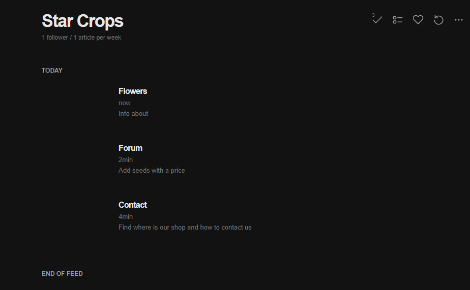

# Star Crops

This project it's about a website that sells seeds, fruits, vegetables, trees, plants and teach you how to take care of it.

Initially appeared on
[gist](https://gist.github.com/PurpleBooth/109311bb0361f32d87a2). But the page cannot open anymore so that is why I have moved it here.

### Prerequisites

Requirements for the software and other tools to build, test and push 
- [Visual Studio Code](https://code.visualstudio.com/)

## Author

  - **Mauricio Gil Armas**
    [Mgilarmas](https://github.com/Mgilarmas)

  - **Firehosting**
    [Star Crops](https://starcropsproject.web.app/)
    
  - **Feedly RSS**
    

## External Reference

  [W3School](https://www.w3schools.com/)
  [StackOverflow](https://es.stackoverflow.com/)
  [MDN web docs](https://developer.mozilla.org/es/)

## Acknowledgments

  - Echedey
  - Wilmer
  - Aythami
  - Mayer

